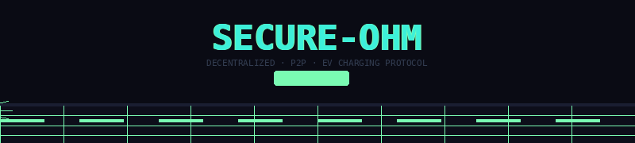

<div align="center">

<!-- Animated GIF Banner — works on GitHub -->


<br/>


</div>

---

## 🌐 Project Overview

**SECURE-OHM** is a high-performance P2P charging ecosystem designed to bridge the gap between EV drivers and private charger owners. By decentralizing energy access, we allow homeowners to monetize their infrastructure while giving drivers a secure, reliable, and grid-aware charging experience.

---

## ⚡ Live System Status

<div align="center">

| 🟢 P2P Encrypted | 🟢 Grid Synced | 🟢 Escrow Active |
|:---:|:---:|:---:|
| End-to-end secured | Real-time load data | Payments verified |

</div>

---

## 🚀 Key Features

### 🏎️ For Drivers — The Seekers

| Feature | Description |
| :--- | :--- |
| 🗺 **Real-Time Discovery** | Dynamic map interface to locate private charging nodes with zero latency |
| ⚡ **Grid-Aware Pricing** | Advanced algorithms calculate session costs based on real-time grid load |
| 🔐 **Biometric Authentication** | High-security login portal for protected session management |
| 📊 **Live Metrics** | Monitor kWh consumption, duration, and cost in real-time |

### 🏠 For Hosts — The Providers

| Feature | Description |
| :--- | :--- |
| 💰 **Monetization Engine** | Turn your home charger into a revenue-generating asset |
| 📈 **Analytics Dashboard** | Revenue tracking, grid load monitoring, and full session history |
| 🔒 **P2P Escrow** | Secure payment simulation ensuring fair exchange every session |
| 🚗 **Fleet Management** | Update charger availability and technical specifications easily |

---

## 🛠️ Technology Stack

| Layer | Technology |
| :--- | :--- |
| **Frontend** | [Next.js 14+](https://nextjs.org/) — App Router |
| **Styling** | [Tailwind CSS](https://tailwindcss.com/) + [Framer Motion](https://www.framer.com/motion/) |
| **Icons** | [Lucide React](https://lucide.dev/) |
| **Type Safety** | [TypeScript](https://www.typescriptlang.org/) — Strict Mode |
| **Animations** | Cinematic CSS Keyframes + Framer Motion |

---

## 📸 Visual Identity

The project features a **Cyberpunk / Glassmorphism** aesthetic, utilizing deep space palettes (`#0a0b14`) and high-contrast neon accents (`#7AFBB3`). The UI is designed to feel like a high-end energy terminal, prioritizing visual feedback and technical precision.

---

## 📁 Project Structure

```
secure-ohm/
├── app/
│   ├── page.tsx              # Landing / Discovery map
│   ├── dashboard/            # Host analytics dashboard
│   ├── session/              # Active charging session view
│   └── auth/                 # Biometric auth portal
├── components/
│   ├── Map/                  # Real-time node map
│   ├── Metrics/              # Live kWh / cost meters
│   └── Escrow/               # P2P payment flow
├── lib/
│   ├── grid.ts               # Grid-aware pricing engine
│   └── p2p.ts                # P2P session protocol
└── public/
```

---

## ⚖️ Secure Protocol

> **SECURE PEER-TO-PEER PROTOCOL V1.0** — Every electron exchanged is accounted for. Every transaction verified. Every node authenticated. The grid forgets nothing.

---

<div align="center">


<br/>

*Built with ❤️ by the SECURE-OHM Team · Powering the future, one node at a time.*

</div>
